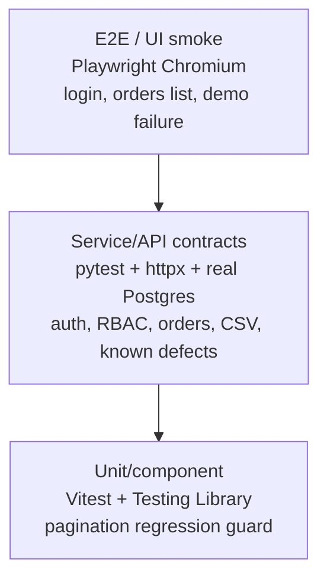

# Test Strategy — Order Processing

## 1. Goal

The goal is to give fast confidence that the Order Processing app is safe to change. The system has a React frontend, FastAPI backend, and Postgres database, so the strategy uses a small test pyramid instead of relying only on browser tests.

The same framework should also work for the next customer app. Order Processing is the reference app; reusable code lives in `qe_toolkit/` and `automation-framework/core/`, while app-specific tests and page objects live under `automation-framework/apps/order_processing/`.

## 2. What Is In Scope

| Area | Covered? | Why |
| --- | --- | --- |
| Authentication and authorization | Yes | Prevents private order and revenue data from leaking. |
| Order lifecycle | Yes | Create, list, detail, update/delete contract, and role behavior are core workflows. |
| Pagination and filtering | Yes | Wrong pagination silently hides or duplicates data. |
| CSV upload | Yes | Bulk upload can create bad data quickly if it is not idempotent. |
| Money totals | Yes | Float drift can corrupt reported totals. |
| Dashboard/test artifacts | Yes | The assignment asks for Monday-morning triage from real test output. |
| Structured logging gaps | Yes | Logging should help debug risky workflows, not create noise. |

Out of scope for this time box: full visual regression, load/performance testing, penetration testing, full accessibility audit, multi-browser matrix, and third-party SaaS reporting.

## 3. Current Test Inventory

| Test area | Count / artifact | Purpose |
| --- | --- | --- |
| Backend pytest | 14 tests | API contracts, auth/RBAC, order workflows, and encoded known defects. |
| Known-defect guards | 5 backend `xfail(strict=True)` + 1 frontend `it.fails` | Keep documented bugs executable until they are fixed. |
| Frontend Vitest | 1 spec | Component-level regression guard for pagination total pages. |
| Automation framework | 8 pytest specs | UI smoke, API smoke/session, functional health, optional LLM eval, and dashboard demo failure. |
| CI jobs | 4 jobs | `backend`, `frontend-unit`, `integration`, `insights-snapshot`. |
| CI gates | 4 gates | Coverage floor, coverage baseline regression, flake warning, dashboard ingest snapshot. |

## 4. Risk-Based Priorities

| Priority | Risk | Example bug | Test approach |
| --- | --- | --- | --- |
| P0 | Sensitive data exposed without login | B4 — `/orders/stats` returns `200` without auth | API contract test expects `401`. |
| P1 | Wrong money/data totals | B3 — float math for currency | API defect test documents Decimal expectation. |
| P1 | Duplicate or missing records | B1 pagination overlap, B2 duplicate CSV upload | API tests for page boundaries and idempotent import behavior. |
| P1 | Misleading API contract | B7 — `DELETE` returns `204` but row still exists | API defect test documents expected delete contract. |
| P1/P2 | UI gives stale or incomplete data | F1/F2 filter refresh/race, F3 page count | Vitest for page-count math; Playwright smoke for critical UI path. |
| P2 | Poor triage signal | Missing logs / stale trends | Structured logs plus dashboard ingest from JUnit/Playwright artifacts. |

The known-defect tests intentionally use `pytest.mark.xfail(strict=True)` or Vitest `it.fails`. While the bug exists, the test is an expected failure. When a developer fixes the bug, the test unexpectedly passes (`XPASS`) and fails the build until the marker is removed. That prevents silent fixes from leaving stale "known bug" markers behind.

## 5. Test Pyramid

| Layer | Tooling | What it proves | Why this layer |
| --- | --- | --- | --- |
| Unit/component | Vitest + Testing Library | Component rules like `Math.ceil` page count. | Fastest place to catch simple UI logic bugs. |
| Service/API | pytest + httpx + Postgres | Auth, RBAC, order contracts, pagination, CSV ingest, Decimal expectations. | Most important business behavior is cheaper and more stable to test here. |
| E2E/UI | Playwright Chromium | User can sign in and see orders through the deployed stack. | Confirms wiring across frontend, backend, and browser only for critical paths. |

## 6. CI Strategy

CI runs in `.github/workflows/ci.yml` and is designed to fail for meaningful quality regressions.

| Job | What it runs | Quality signal |
| --- | --- | --- |
| `backend` | FastAPI pytest against Postgres service container | `--cov-fail-under=48`, baseline coverage check, flake reruns, JUnit output. |
| `frontend-unit` | Vitest | Frontend regression guards stay executable. |
| `integration` | `automation-framework` against `docker compose` | UI/API/LLM harness runs against real services; demo failure excluded with `-m "not demo_intentional_fail"`. |
| `insights-snapshot` | Dashboard ingest against uploaded artifacts | Proves the dashboard can parse the latest JUnit/Playwright artifacts and create SQLite history. |

Important gates:

- **Coverage floor:** backend pytest must stay at or above `48%`.
- **Coverage regression check:** `scripts/check_coverage_vs_baseline.py` compares `coverage.xml` to `app/backend/coverage_baseline.txt`.
- **Flake signal:** `--reruns 2` plus `scripts/flag_flakes_from_junit.py` emits GitHub Actions warnings for tests that only passed after rerun.
- **Honest CI:** the shared pytest hook fails CI if zero tests actually reach the call phase.
- **Dashboard artifact path:** JUnit XML, Playwright JSON/HTML, coverage XML, and dashboard SQLite are all published under `test-results/`.

## 7. Extensibility To Other Customer Solutions

The framework is intentionally split:

| Part | Responsibility |
| --- | --- |
| `qe_toolkit/` | Vendor-neutral helpers: pytest fixtures, JUnit parser, Playwright parser, coverage gate. |
| `automation-framework/core/` | Reusable API/UI/LLM/config/logging building blocks. |
| `automation-framework/apps/order_processing/` | Customer-specific app bundle: config, page objects, API helpers, tests. |
| `automation-framework/dashboard/` | Reads artifacts and shows run history; not tied to Order Processing. |

For a new customer app, add a new `automation-framework/apps/<customer>/` bundle and reuse the same core utilities, CI shape, artifact format, and dashboard. The step-by-step recipe is in `docs/ONBOARDING_NEW_CUSTOMER.md`.

Examples:

- **API-only service:** skip Playwright; keep backend/API pytest, JUnit output, coverage gate, and dashboard ingest.
- **LLM pipeline:** replace UI tests with eval tests that emit JUnit XML; dashboard still works because it reads standard JUnit.
- **Performance/concurrency suite:** add k6/Locust as a non-blocking workflow and publish metrics beside test artifacts; dashboard already has project-aware run history.

For the internal framework package diagram, see `automation-framework/README.md`.

## 8. Deferrals

These are intentionally deferred, not forgotten:

- Full axe accessibility audit on every PR. One Vitest `it.fails` documents the current label gap.
- Multi-browser matrix. Chromium only keeps CI runtime predictable for this assignment.
- Load/performance suite. Worth adding later with k6/Locust once functional risk is stable.
- External payment/provider contract tests. Not applicable to this sample domain yet.

The release quality bar is captured in `docs/DEFINITION_OF_DONE.md`.
