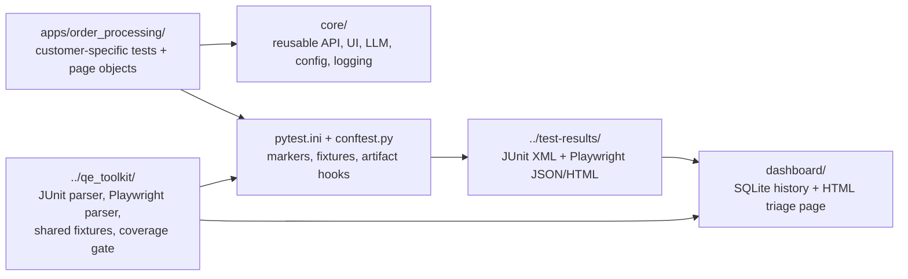

# Automation Framework

This folder contains the reusable UI/API/LLM automation framework used for the Order Processing assignment.

Order Processing is the reference app. A future customer should add a new `apps/<customer>/` bundle and reuse the same core framework, artifact format, CI shape, and dashboard.

For the higher-level test strategy, see [`../TEST_STRATEGY.md`](../TEST_STRATEGY.md).

## What This Framework Does

| Capability | What it provides |
| --- | --- |
| UI testing | Playwright page objects and Chromium smoke tests. |
| API testing | Shared `httpx` client and customer-specific API tests. |
| LLM eval smoke | Optional eval harness behind `RUN_LLM_EVAL=1`. |
| App bundles | Per-customer config, page objects, API helpers, and tests under `apps/`. |
| Artifacts | JUnit XML, Playwright JSON/HTML, screenshots/videos, and Allure results. |
| Dashboard input | Artifacts are written to `../test-results/` for the dashboard to ingest. |

## Simple Architecture



Read the diagram like this:

- `apps/order_processing/` is the only Order Processing-specific bundle.
- `core/` is reusable framework code shared by any customer.
- `pytest.ini` and `conftest.py` configure markers, fixtures, and artifact output.
- `../test-results/` is the handoff point between tests and dashboard.
- `../qe_toolkit/` sits outside this folder because CI scripts, backend tests, and the dashboard all reuse it.

## Folder Map

```text
automation-framework/
├── apps/
│   └── order_processing/
│       ├── config/          # App routes, personas, base URL config
│       ├── ui/pages/        # Page objects
│       ├── api/             # App-specific API helpers
│       └── tests/
│           ├── ui/          # Playwright tests
│           ├── api/         # API tests
│           └── llm/         # Optional LLM eval smoke
├── core/
│   ├── api/                 # Shared API client/auth helpers
│   ├── ui/                  # Base page, registry, waits, actions
│   ├── llm/                 # Eval runner and evaluator adapters
│   ├── config/              # YAML/env loading
│   └── logging/             # Framework logging setup
├── configs/                 # base/dev/qa/stage/prod YAML
├── shared/                  # Common mocks, schemas, and test data
├── assets/                  # LLM golden data and schemas
├── tests/functional/        # Cross-layer tests not tied to one app bundle
├── dashboard/               # Test insights dashboard
├── conftest.py              # Framework fixtures and Playwright JSON hook
└── pytest.ini               # Markers and default artifact output
```

## How To Run

Run from repo root unless noted.

### 1. Start the app stack

```bash
cd /Users/prasanna/GitHub/Assignment
docker compose -f infra/docker-compose.yml up -d --build
```

### 2. Install framework dependencies

```bash
cd automation-framework
pip install -r requirements.txt
python3 -m playwright install chromium
```

### 3. Run the CI-equivalent framework suite

This excludes the intentionally failing dashboard-demo test.

```bash
python3 -m pytest -m "not demo_intentional_fail"
```

### 4. Run the full suite including the demo failure

Use this only for the dashboard triage demo.

```bash
python3 -m pytest
```

### 5. Run by layer

```bash
python3 -m pytest -m ui
python3 -m pytest -m api
python3 -m pytest -m functional
RUN_LLM_EVAL=1 python3 -m pytest -m llm_eval
```

## Useful Environment Variables

| Variable | Purpose | Default |
| --- | --- | --- |
| `AUTOMATION_APP` | Selects the app bundle under `apps/`. | `order_processing` |
| `AUTOMATION_API_BASE_URL` | Overrides the API base URL for API tests. | Config YAML value |
| `PLAYWRIGHT_BASE_URL` | Overrides the frontend URL for UI tests. | Config YAML value |
| `RUN_LLM_EVAL` | Enables optional LLM eval tests. | unset / disabled |

Legacy aliases `INTEGRATION_APP` and `E2E_CUSTOMER` are still accepted for app selection.

## Artifacts Produced

Running pytest writes artifacts to `../test-results/`:

| Artifact | Purpose |
| --- | --- |
| `junit-automation.xml` | JUnit results for automation tests. |
| `playwright-report.json` | Playwright-shaped JSON used by the dashboard. |
| `playwright-html/` | HTML report. |
| `playwright-output/` | Screenshots, videos, and traces when available. |
| `allure-results/` | Allure-compatible raw results. |

The dashboard reads these files and builds run history.

## Dashboard

Start the dashboard from the repo root:

```bash
docker compose -f infra/docker-compose.yml up -d dashboard
open http://localhost:4000
```

Ingest latest artifacts:

```bash
curl -X POST http://localhost:4000/api/ingest
```

For demo runs, use:

```bash
curl -X POST 'http://localhost:4000/api/ingest?force_duplicate=true'
```

`force_duplicate=true` is useful during recording because the dashboard normally deduplicates identical artifact sets.

## Adding Another Customer App

To add another app:

1. Create `automation-framework/apps/<customer>/`.
2. Add `config/app_config.py` with routes, personas, and base URLs.
3. Add page objects under `ui/pages/`.
4. Add API helpers under `api/` if needed.
5. Add tests under `tests/ui`, `tests/api`, or `tests/llm`.
6. Register the page object bundle in the framework registry.
7. Run with `AUTOMATION_APP=<customer> python3 -m pytest`.

Full onboarding steps are documented in [`../docs/ONBOARDING_NEW_CUSTOMER.md`](../docs/ONBOARDING_NEW_CUSTOMER.md).

## Important Note About The Demo Failure

`apps/order_processing/tests/ui/test_demo_intentional_fail.py` is deliberately red. It is used only to demonstrate dashboard triage.

CI excludes it with:

```bash
python3 -m pytest -m "not demo_intentional_fail"
```

Do not remove it unless the dashboard demo is no longer needed.
